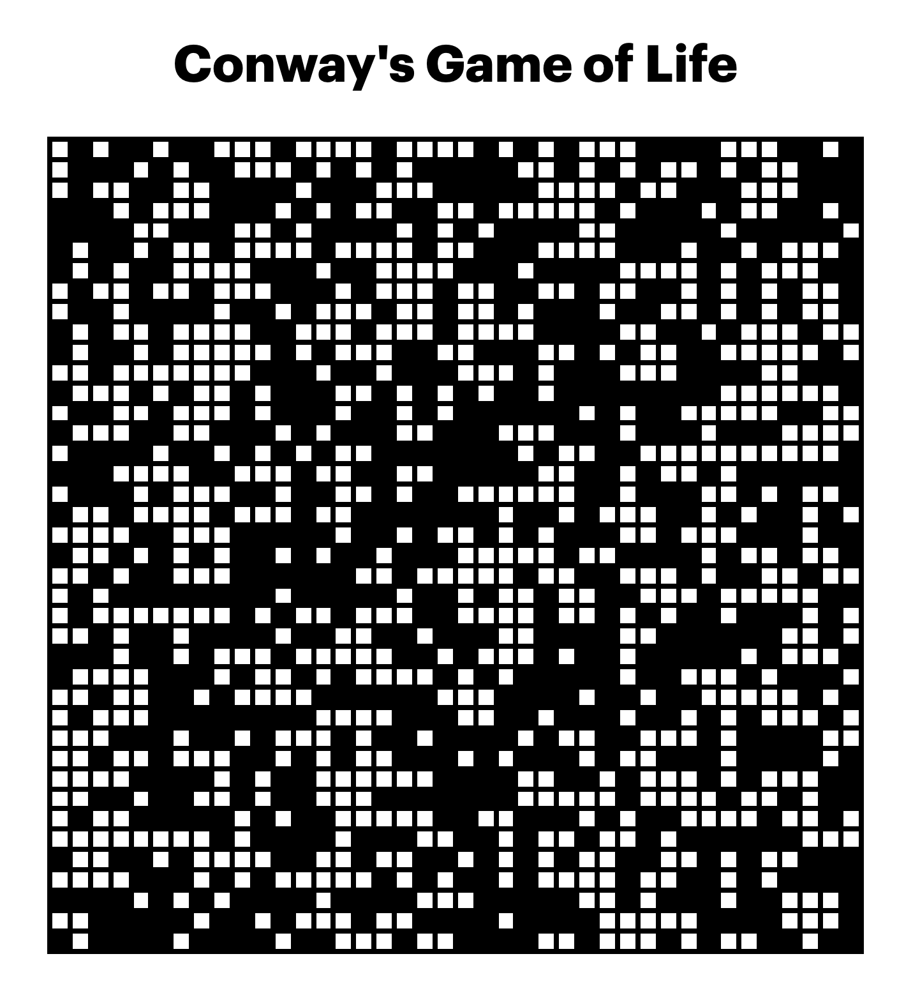
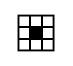

# John Conway - The Game of life



You can see the live app here: https://game-of-life-test.netlify.app/

# Resources

- The main logic of the app was inspired by the video and the code in this page https://thecodingtrain.com/CodingChallenges/085-the-game-of-life.html. 

- The way in which the timer is configured comes from this tutorial: [How to develop a Stopwatch in React JS with custom hook](https://dev.to/abdulbasit313/how-to-develop-a-stopwatch-in-react-js-with-custom-hook-561b).

- In this SO answer [useState with `new` keyword as parameter](https://stackoverflow.com/a/64131447) I have found out how to declare a class in a functional React component.

# Reasoning

The current state of the cells is stored in a two-dimensional array. Every cell can be alive or dead. A dead cell will have a value of 0, while a living cell will have a value of 1. 

The first state of the application is computed with a random function that assigns a 0 or a 1 to each value in the two-dimensional array. 

Once we have created the array to store the state of all the cells we need to loop over all of them in order to compute the number of neighbors it has. 



In order to compute the number of the neighbors we need to loop around every cell from the index of -1, -1 to the index of 1, 1 relative to the cell that we are considering, remembering not to count the state of the cell itself.

The looping part is accomplished with two nested loops which go from one index to the next.

```javascript
for (let i = -1; i < 2; i += 1) {
  for (let j = -1; j < 2; j += 1) {
    // identify current cell in order to skip it later
    const isCurrentCell = i === 0 && j === 0;
    // do the rest
  }
}
```

We also need to be careful that there can be `undefined` indexes when we are looping close to the edges. 
Luckily there are two recent additions of ES6 which can help us: the nullish coalescence operator and the optional chaining operator. 

```javascript
const value = grid?.[x + i]?.[y + j] ?? 0;
```
In this way we are sure that the code won’t break when it finds `undefined` indexes. Also, we can consider `undefined` values as zeroes, because we are counting living cells (each with a value of 1).

After we have found all the neighbors for each cell, the reasoning (based on Daniel Shiffman’s video) is the following: 
- passage from life to death: if a cell is alive, it will die if the number of neighbors is less than 2 or more than 3
- from death to life: if a cell is dead, it will come to life if it has exactly 3 neighbors
- all the other cells keep their state

Every new generation is computed based on the current generation, so it’s important to keep the current state unaltered while the code loops through it. This can be accomplished by keeping two variables with two separate arrays or by not mutating the original value. 

For example in the `computeNextGeneration` function the next generation is computed with a `map()` function (which does not mutate the original), while in the `getUpdatedGeneration` function the change is computed by cloning the original array and then updating only a single value in the new array. 

# Application structure

## "World" class

All the logic related to the cells has been placed in a class called World. This class is keeping an internal array with the states but also returning it to the methods that update it. The functions used to create 2D arrays and to generate random numbers have been put into separate modules. 

## Main logic
The main logic is defined in the `App.js` file by two React hooks: one that manages the state with `grid` and `setGrid` and another that instantiates the World class into another variable, `world`.

Once we have this in place we can call all the methods on the `world` instance and update the internal state, like this: 
```javascript
const handleNextGeneration = () => {
  // we call a method on the `world` instance
  const nextGrid = world.getNextGeneration(grid);
  // we update the state with `setGrid`
  setGrid(nextGrid);
  // [...]
}
```
The rest of the main `App.js` logic is used to manage the timer, to manage two internal states (`isRunning` and `isDrawing`) and to declare some functions called by the UI.

## Components communication
The state of the grid is passed to the `Grid` component through the `currentGeneration` prop.

Other props are used to pass the current state of the application (`isRunning`, `isDrawing`) and to pass two functions that can be called by child components (`Grid` or `Cell`). 

For example the `updateCell` function is defined in `App.js`, then is passed down as a prop and is called by the `Cell` component. The coordinates passed by the `Cell` component in the `updateCell` function are passed themselves as props by the `Grid` component, otherwise the `Cell` itself wouldn't know its own coordinates.

```jsx
<div className="Grid-main">
  {currentGeneration.map((row, i) => {
    return (
      <div className="Grid-row" key={i}>
        {row.map((cell, j) => {
          return <Cell
            key={`${i}-${j}`}
            value={cell}
            updateCell={updateCell}
            coords={{x: i, y: j}}  {/* 👈 here we pass the coordinates to the `Cell` component */}
            isDrawing={isDrawing}
          />;
        })}
      </div>
    );
  })}
</div>
```

## Drawing
The `isDrawing` state is set to true by a `mouseDown` event on the grid, but can be set to false by any `mouseUp` event in the application. When `isDrawing` is set to true we can simulate drawing by listening to a `mouseEnter` event inside the single cells.

## Mobile
The app is responsive and can be viewed from mobile devices, but the drawing functionality is missing. 

# Possible improvements

### Touch devices
I tried to port the drawing functionality to touch devices but it didn't work as expected and I didn't have enough time to work on it.

### `requestAnimationFrame`
I'm not sure, but instead of `setInterval` I could have used `requestAnimationFrame`. I should investigate this because this API is intended for animations and maybe wouldn't suit this use case. 

### Further configuration in the UI
The app could let the user configure the grid with new settings like the number of cells, their size, or the speed of the animation.

# How to run

This project was bootstrapped with [Create React App](https://github.com/facebook/create-react-app).

In the project directory, you can run:

### `npm start`

Runs the app in the development mode.\
Open [http://localhost:3000](http://localhost:3000) to view it in the browser.

The page will reload if you make edits.\
You will also see any lint errors in the console.

### Other Scripts
You can also run `npm run build` if you need an optimzed build for production. 

